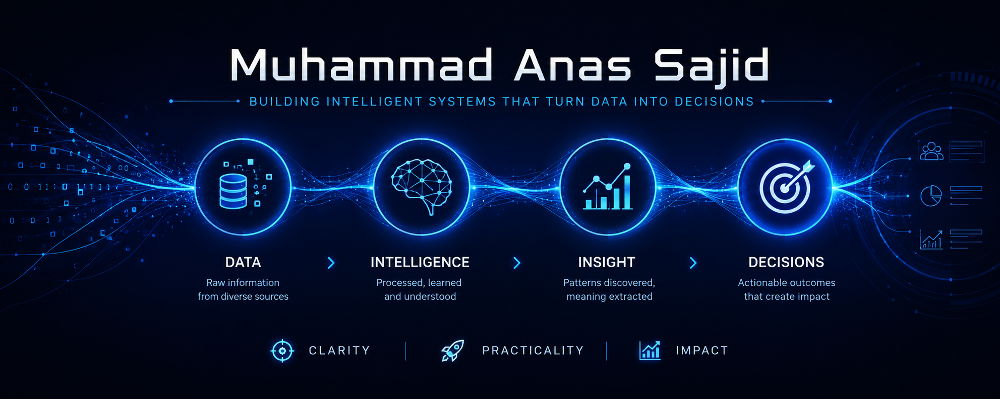

  

---

# About

I build intelligent software systems that transform data into actionable outcomes.

My interests lie at the intersection of machine learning, software engineering, and cloud technologies, with a focus on developing practical solutions that deliver measurable value.

---

# Capability Stack

### Data

### Intelligence

### Engineering

### Delivery

---

# Building Blocks

<table>
<tr>

<td width="50%">

## <a href="https://github.com/Muhammad-11Anas/ChurnIQ">ChurnIQ</a>

**Customer Data → Machine Learning → Retention Intelligence**

Machine learning solution designed to identify at-risk customers and support data-driven retention strategies.

</td>

<td width="50%">

## <a href="https://github.com/Muhammad-11Anas/AI-Recruitment-Agent">AI Recruitment Agent</a>

**Resume Data → AI Analysis → Hiring Decisions**

AI-assisted recruitment workflow for candidate evaluation and decision support.

</td>

</tr>

<tr>

<td width="50%">

## <a href="https://github.com/Muhammad-11Anas/nodejs-k8s-ecr-demo">Kubernetes ECR Demo</a>

**Application → Containerization → Deployment**

Cloud-native deployment workflow using Docker, Kubernetes, and AWS.

</td>

<td width="50%">

## <a href="https://github.com/Muhammad-11Anas/LR-0-Parser">LR(0) Parser</a>

**Language Rules → Parsing Logic → Structured Output**

Implementation of compiler construction fundamentals and parsing systems.

</td>

</tr>
</table>

---

# Activity

---

# Principles

Clarity • Practicality • Impact

---

